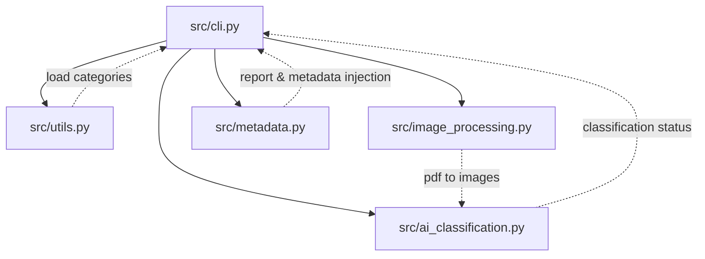

<!-- generated-by: gsd-doc-writer -->
# Architecture

## System Overview

The File-Categorizer is a CLI application that processes Arabic PDF documents by converting them to images, enhancing the images for OCR readability, and utilizing a Vision Model (Gemma) to classify each page into user-defined categories. Finally, it generates a structured JSON report and injects metadata back into a categorized version of the PDF.

## Component Diagram

## Data Flow

1. **Input Parsing**: `cli.py` reads user arguments, loading categories from `utils.py` and expanding glob patterns for input PDFs.
2. **Image Processing**: `process_pdf` inside `image_processing.py` converts each PDF page to an image and applies enhancements (division normalization and diacritic boosting) for better readability.
3. **AI Classification**: `classify_pages` in `ai_classification.py` sends the processed images to a Vision Model (Gemma 4 26B) which classifies each page against the loaded categories.
4. **Metadata Generation**: The classification status is collected in `cli.py` and passed to `generate_report` and `inject_pdf_metadata` in `metadata.py` to create a structured JSON report and a final output PDF containing the embedded metadata.

## Key Abstractions

- `parse_args` in `src/cli.py` — Parses CLI arguments and handles glob expansions.
- `process_pdf` in `src/image_processing.py` — Converts PDF pages to enhanced images.
- `classify_pages` in `src/ai_classification.py` — Prompts the vision model for page classification.
- `generate_report` in `src/metadata.py` — Formats the AI classification output into a structured report.
- `inject_pdf_metadata` in `src/metadata.py` — Creates the final categorized PDF with embedded metadata.

## Directory Structure Rationale

- `src/` — Contains the application source code modules, separated by functional responsibilities.
- `docs/` — Contains the project documentation.
- `tests/` — Test files for the application (e.g., using pytest).
